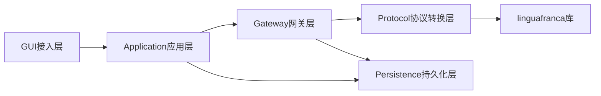

# Silk 改造计划文档

## 📋 文档概述

本文档是Silk项目从技术API网关转型为个人AI总机的完整改造计划。

## 📁 文档结构

```
docs/
├── plan/                           # Phase级别计划
│   ├── phase1-architecture-decoupling.md    # Phase 1: 架构硬性拆分
│   ├── phase2-user-experience-optimization.md # Phase 2: 产品体验优化
│   └── phase3-documentation-testing.md      # Phase 3: 文档与测试
│
├── task/                           # 任务级别文件
│   ├── phase1-batch1-protocol-converter-core.md      # Phase 1 批次1
│   ├── phase1-batch2-stream-converter.md              # Phase 1 批次2
│   ├── phase1-batch3-integration-error-handling.md    # Phase 1 批次3
│   ├── phase2-batch1-startup-onboarding.md            # Phase 2 批次1
│   ├── phase2-batch2-logging-error-handling.md        # Phase 2 批次2
│   ├── phase2-batch3-config-quick-actions.md          # Phase 2 批次3
│   ├── phase2-batch4-ui-optimization-help.md          # Phase 2 批次4
│   ├── phase3-batch1-technical-documentation.md       # Phase 3 批次1
│   ├── phase3-batch2-user-documentation.md            # Phase 3 批次2
│   ├── phase3-batch3-unit-testing.md                  # Phase 3 批次3
│   └── phase3-batch4-integration-quality.md           # Phase 3 批次4
│
└── README.md                       # 本文件
```

## 🎯 改造目标

### 产品定位转型
- **旧定位**：技术API网关（面向开发者）
- **新定位**：个人AI总机（面向普通用户）

### 核心价值
1. **统一访问**：一个入口访问所有AI服务
2. **智能路由**：自动选择最佳AI服务
3. **协议转换**：支持多种AI协议
4. **用户友好**：隐藏技术细节，降低使用门槛

## 📊 Phase 概览

### Phase 1: 架构硬性拆分（3周）

**目标**：将协议转换逻辑从Gateway网关层完全剥离，创建独立的无状态协议转换层

**批次**：
1. 协议转换核心模块创建（第1周）
2. 流式处理层独立化（第2周）
3. 集成与错误处理（第3周）

**关键交付物**：
- 协议转换抽象层（`protocol/converter.rs`）
- 流式转换抽象层（`protocol/stream/converter.rs`）
- 用户友好的错误处理层（`error/user_friendly.rs`）

### Phase 2: 产品体验优化（4周）

**目标**：将产品从开发者工具转型为面向普通用户的个人AI总机

**批次**：
1. 启动流程与引导系统（第1周）
2. 日志系统与错误处理（第2周）
3. 配置优化与快捷操作（第3周）
4. 界面优化与帮助系统（第4周）

**关键交付物**：
- 启动画面和引导页
- 用户友好的错误提示组件
- 预置AI服务配置库
- 快捷操作面板
- 帮助系统

### Phase 3: 文档与测试（3周）

**目标**：完善文档体系，补充测试用例，确保产品质量

**批次**：
1. 技术文档编写（第1周）
2. 用户文档编写（第2周）
3. 单元测试补充（第3周前半）
4. 集成测试与质量保障（第3周后半）

**关键交付物**：
- 架构设计文档
- API文档
- 用户手册
- 单元测试和集成测试

## 📅 总体时间表

| Phase | 预计工期 | 主要目标 |
|-------|----------|----------|
| Phase 1 | 3周 | 架构硬性拆分 |
| Phase 2 | 4周 | 产品体验优化 |
| Phase 3 | 3周 | 文档与测试 |
| **总计** | **10周** | **完整改造** |

## 🔍 技术架构

### 分层架构

```
┌─────────────────────────────────────────────────────────────┐
│                 Layer 1: GUI接入层                          │
│                 (用户交互、界面展示)                         │
├─────────────────────────────────────────────────────────────┤
│                 Layer 2: Application应用层                  │
│                 (业务逻辑、状态管理)                         │
├─────────────────────────────────────────────────────────────┤
│                 Layer 3: Gateway网关层                      │
│                 (请求路由、管道处理)                         │
├─────────────────────────────────────────────────────────────┤
│                 Layer 4: Protocol协议转换层                  │
│                 (无状态、流式处理、字节流转换)               │
└─────────────────────────────────────────────────────────────┘
```

### 模块依赖关系



## 📦 核心模块

### 1. 协议转换层

**职责**：无状态协议转换、流式字节流处理

**支持协议**：
- OpenAI Chat Completions
- Claude Messages
- OpenAI Responses

**关键接口**：
- `ProtocolConverter`：非流式转换
- `StreamConverter`：流式转换
- `ConverterRegistry`：转换器注册表

### 2. Gateway网关层

**职责**：HTTP请求处理、中间件管道、路由分发

**中间件管道**：
1. `extract` - 提取请求信息
2. `authenticate` - 认证验证
3. `resolve_route` - 路由解析
4. `select_channel` - 渠道选择
5. `transform_request` - 请求转换
6. `dispatch_upstream` - 转发上游
7. `transform_response` - 响应转换
8. `persist_log` - 日志持久化
9. `finalize` - 最终处理

### 3. Application应用层

**职责**：业务逻辑编排、状态管理、服务协调

**主要服务**：
- `gateway_service` - 网关服务
- `provider_service` - Provider服务
- `log_service` - 日志服务
- `settings_service` - 设置服务

### 4. GUI接入层

**职责**：用户界面展示、用户交互处理

**主要组件**：
- `App.vue` - 应用根组件
- `AppContent.vue` - 主布局组件
- `views/` - 页面组件
- `components/` - 通用组件

## 🎨 用户体验优化

### 启动流程

```
启动 → 显示启动画面 → 初始化服务 → 检测首次运行 → 
  ├─ 首次：显示引导页 → 一键配置 → 显示主界面
  └─ 非首次：加载配置 → 自动启动网关(如果配置) → 显示主界面
```

### 错误处理

**旧方式**：直接透出上游API的原始JSON错误

**新方式**：转换为用户友好的中文提示

```rust
// 旧：直接透出
"上游API返回401: {\"error\":{\"message\":\"Invalid API key\"}}"

// 新：用户友好
"AI服务认证失败，请检查您的API密钥是否正确"
```

### 日志可视化

- 分级显示（DEBUG、INFO、WARN、ERROR）
- 搜索和过滤功能
- 导出功能
- 用户友好的错误提示

## 📈 质量保障

### 测试策略

1. **单元测试**：覆盖率达到80%以上
2. **集成测试**：覆盖核心流程
3. **性能测试**：启动时间、响应时间、内存占用
4. **安全测试**：输入验证、权限检查、漏洞扫描

### 代码质量

- 代码审查流程
- 静态代码分析
- 依赖安全检查
- 性能监控

## 🚀 快速开始

### 查看计划

1. 阅读 `docs/plan/` 目录下的Phase级别计划
2. 阅读 `docs/task/` 目录下的任务级别文件
3. 按照时间表执行任务

### 执行任务

1. 选择当前Phase和批次
2. 按照任务清单执行
3. 完成验收标准
4. 进入下一个任务

### 跟踪进度

1. 更新任务状态
2. 记录遇到的问题
3. 调整计划（如需要）

## 📞 联系支持

如有问题，请通过以下方式联系：

- **GitHub Issues**：报告bug或请求功能
- **GitHub Discussions**：交流讨论
- **邮箱**：support@silk.dev

## 📝 更新日志

### 2024-01-01
- 创建完整的改造计划文档
- 细化所有Phase和批次任务
- 添加技术架构说明
- 添加用户体验优化方案

---

**最后更新**：2024-01-01
**文档版本**：1.0.0
**维护者**：Silk开发团队
