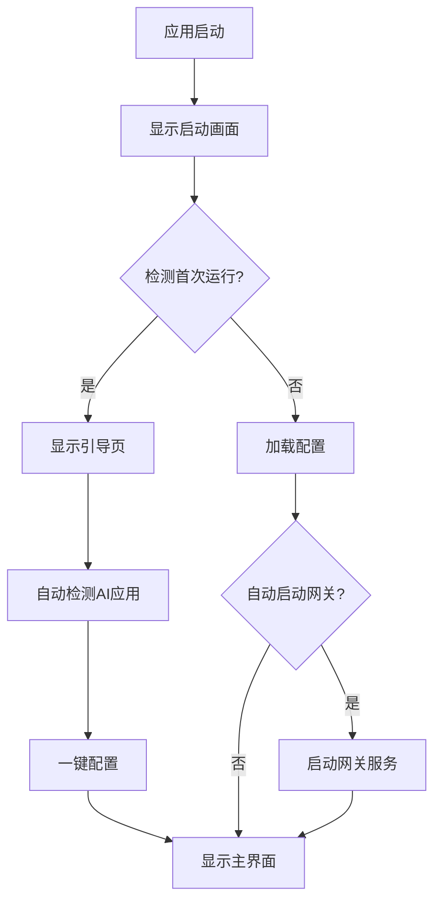

# Phase 2: 产品体验优化 - 面向小白用户的交互重构

## 📋 阶段概述

**阶段目标**：将产品从开发者工具转型为面向普通用户的个人AI总机

**核心价值**：
- 解决当前产品对小白用户不友好的问题
- 提供直观、易用的图形界面和引导流程
- 隐藏技术细节，降低使用门槛

**依赖关系**：Phase 1 完成（需要独立的协议转换层和错误处理层）

**预计工期**：3-4周

---

## 🎯 阶段目标

### 2.1 核心目标
1. **启动流程优化**：添加启动画面、首次引导页、自动配置
2. **日志可视化增强**：增强日志展示，分级显示，用户友好提示
3. **默认配置优化**：预置常用AI服务配置，一键添加
4. **状态提示优化**：统一Loading、Success、Error提示组件
5. **快捷操作面板**：添加常用AI服务快捷入口

### 2.2 质量目标
- 首次启动到可用状态 < 3分钟
- 用户无需阅读文档即可完成基础配置
- 错误提示100%用户友好（无技术术语）

---

## 📦 任务批次划分

### 批次1：启动流程与引导系统（第1周）

**任务1.1：创建启动画面组件**
- 文件：`src/components/SplashScreen.vue`
- 内容：显示品牌Logo、加载进度、版本信息
- 依赖：无

**任务1.2：创建首次引导页组件**
- 文件：`src/components/OnboardingWizard.vue`
- 内容：分步引导用户完成初始配置
- 依赖：任务1.1

**任务1.3：实现自动检测已安装AI应用**
- 文件：`src-tauri/src/application/auto_detect.rs`
- 内容：检测本地已安装的AI客户端（ChatGPT、Claude等）
- 依赖：无

**任务1.4：实现一键配置功能**
- 文件：`src-tauri/src/application/quick_setup.rs`
- 内容：根据检测结果自动生成配置
- 依赖：任务1.3

### 批次2：日志系统与错误处理（第2周）

**任务2.1：增强日志可视化组件**
- 文件：`src/views/LogsView.vue`
- 内容：添加分级显示、搜索、过滤功能
- 依赖：无

**任务2.2：创建用户友好的错误提示组件**
- 文件：`src/components/UserFriendlyError.vue`
- 内容：显示用户友好的错误信息，隐藏技术细节
- 依赖：Phase 1 任务3.3

**任务2.3：实现错误信息转换服务**
- 文件：`src/services/errorConverter.ts`
- 内容：前端调用后端错误转换API
- 依赖：任务2.2

**任务2.4：创建日志分级显示**
- 文件：`src/components/LogViewer.vue`
- 内容：区分技术日志和用户日志，分级显示
- 依赖：任务2.1

### 批次3：配置优化与快捷操作（第3周）

**任务3.1：创建预置AI服务配置库**
- 文件：`src-tauri/src/data/preset_providers.json`
- 内容：OpenAI、Claude、文心一言等常用配置
- 依赖：无

**任务3.2：实现配置导入导出功能**
- 文件：`src-tauri/src/application/config_transfer.rs`
- 内容：支持配置文件导入导出
- 依赖：任务3.1

**任务3.3：创建快捷操作面板组件**
- 文件：`src/components/QuickActions.vue`
- 内容：常用AI服务快捷入口，一键切换
- 依赖：任务3.1

**任务3.4：实现智能默认配置**
- 文件：`src-tauri/src/application/smart_defaults.rs`
- 内容：根据用户环境自动推荐配置
- 依赖：任务1.3

### 批次4：界面优化与状态管理（第4周）

**任务4.1：优化主界面布局**
- 文件：`src/AppContent.vue`
- 内容：重新设计主界面，更符合普通用户习惯
- 依赖：无

**任务4.2：创建统一状态提示组件**
- 文件：`src/components/StatusIndicator.vue`
- 内容：统一Loading、Success、Error提示样式
- 依赖：无

**任务4.3：优化设置页面**
- 文件：`src/views/SettingsView.vue`
- 内容：简化设置项，添加说明和示例
- 依赖：无

**任务4.4：添加帮助系统**
- 文件：`src/components/HelpSystem.vue`
- 内容：内置帮助文档、常见问题、使用教程
- 依赖：无

---

## 🔍 技术方案

### 2.3 启动流程设计



### 2.4 引导页设计

```vue
<!-- src/components/OnboardingWizard.vue -->
<template>
  <div class="onboarding-wizard">
    <div class="wizard-header">
      <h1>欢迎使用 Silk</h1>
      <p>您的个人AI总机</p>
    </div>
    
    <div class="wizard-steps">
      <n-steps :current="currentStep">
        <n-step title="欢迎" />
        <n-step title="检测AI应用" />
        <n-step title="配置服务" />
        <n-step title="完成" />
      </n-steps>
    </div>
    
    <div class="wizard-content">
      <!-- 步骤1: 欢迎 -->
      <div v-if="currentStep === 0">
        <h2>什么是Silk？</h2>
        <p>Silk是您的个人AI总机，让您在一个地方访问所有AI服务。</p>
        <p>无需复杂配置，一键即可开始使用。</p>
      </div>
      
      <!-- 步骤2: 检测AI应用 -->
      <div v-if="currentStep === 1">
        <h2>检测您的AI应用</h2>
        <p>我们正在检测您电脑上已安装的AI应用...</p>
        <n-spin v-if="detecting" />
        <div v-else>
          <n-list>
            <n-list-item v-for="app in detectedApps" :key="app.name">
              <n-thing :title="app.name" :description="app.description" />
            </n-list-item>
          </n-list>
        </div>
      </div>
      
      <!-- 步骤3: 配置服务 -->
      <div v-if="currentStep === 2">
        <h2>配置AI服务</h2>
        <p>选择您要使用的AI服务：</p>
        <n-checkbox-group v-model:value="selectedServices">
          <n-checkbox value="openai" label="OpenAI (ChatGPT)" />
          <n-checkbox value="claude" label="Claude" />
          <n-checkbox value="wenxin" label="文心一言" />
        </n-checkbox-group>
      </div>
      
      <!-- 步骤4: 完成 -->
      <div v-if="currentStep === 3">
        <h2>配置完成！</h2>
        <p>您现在可以开始使用Silk了。</p>
        <p>点击下方按钮进入主界面。</p>
      </div>
    </div>
    
    <div class="wizard-actions">
      <n-button v-if="currentStep > 0" @click="prevStep">上一步</n-button>
      <n-button type="primary" @click="nextStep">
        {{ currentStep === 3 ? '开始使用' : '下一步' }}
      </n-button>
    </div>
  </div>
</template>
```

### 2.5 错误提示组件设计

```vue
<!-- src/components/UserFriendlyError.vue -->
<template>
  <n-alert
    v-if="error"
    :title="error.title"
    :type="alertType"
    :description="error.message"
    closable
    @close="$emit('close')"
  >
    <template #action>
      <n-space>
        <n-button v-if="error.suggestion" size="small" @click="showSuggestion">
          查看建议
        </n-button>
        <n-button size="small" @click="$emit('retry')">
          重试
        </n-button>
      </n-space>
    </template>
  </n-alert>
</template>

<script setup lang="ts">
import { computed } from 'vue';
import { NAlert, NButton, NSpace } from 'naive-ui';

interface UserFriendlyError {
  title: string;
  message: string;
  suggestion?: string;
  type: 'error' | 'warning' | 'info';
}

const props = defineProps<{
  error: UserFriendlyError | null;
}>();

const alertType = computed(() => {
  if (!props.error) return 'error';
  return props.error.type || 'error';
});

function showSuggestion() {
  // 显示建议对话框
}
</script>
```

---

## 📊 验收标准

### 2.6 功能验收
- [ ] 首次启动引导流程完整可用
- [ ] 自动检测已安装AI应用功能正常
- [ ] 一键配置功能正常工作
- [ ] 日志可视化增强功能完整
- [ ] 错误提示100%用户友好
- [ ] 预置AI服务配置可用
- [ ] 快捷操作面板功能完整

### 2.7 用户体验验收
- [ ] 首次启动到可用状态 < 3分钟
- [ ] 用户无需阅读文档即可完成基础配置
- [ ] 错误提示无技术术语，100%通俗易懂
- [ ] 界面布局符合普通用户习惯
- [ ] 帮助系统完整可用

### 2.8 性能验收
- [ ] 启动画面加载时间 < 2秒
- [ ] 引导页响应流畅
- [ ] 日志加载和搜索响应时间 < 1秒

---

## 🚨 风险与应对

### 风险1：自动检测AI应用的兼容性问题
- **应对**：优先支持主流AI应用，后续逐步扩展
- **缓解**：提供手动配置作为备选方案

### 风险2：用户引导流程过于复杂
- **应对**：简化步骤，提供跳过选项
- **缓解**：进行用户测试，收集反馈

### 风险3：预置配置的准确性问题
- **应对**：定期更新预置配置，提供反馈渠道
- **缓解**：允许用户自定义配置

---

## 📅 里程碑

| 里程碑 | 时间 | 交付物 |
|--------|------|--------|
| M1: 启动流程与引导系统 | 第1周末 | 启动画面、引导页、自动检测 |
| M2: 日志系统与错误处理 | 第2周末 | 日志可视化、错误提示组件 |
| M3: 配置优化与快捷操作 | 第3周末 | 预置配置、快捷面板、智能默认 |
| M4: 界面优化与帮助系统 | 第4周末 | 界面优化、状态提示、帮助系统 |
