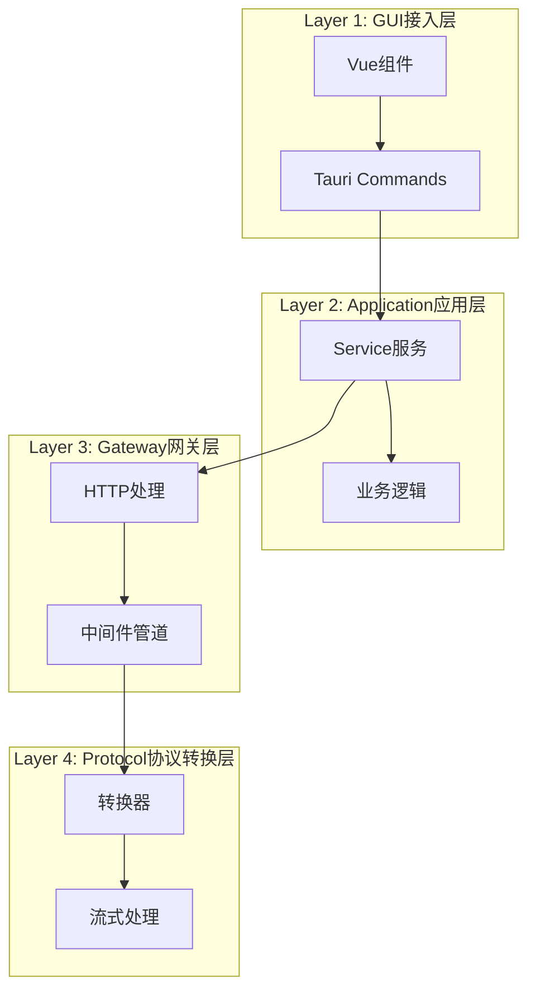

# Phase 3: 文档与测试 - 质量保障与知识沉淀

## 📋 阶段概述

**阶段目标**：完善文档体系，补充测试用例，确保产品质量

**核心价值**：
- 为新架构提供完整的文档支持
- 通过测试保障代码质量和稳定性
- 沉淀知识，便于后续维护和扩展

**依赖关系**：Phase 1、Phase 2 完成

**预计工期**：2-3周

---

## 🎯 阶段目标

### 3.1 核心目标
1. **技术文档完善**：架构设计文档、API文档、开发指南
2. **用户文档完善**：用户手册、使用教程、常见问题
3. **测试用例补充**：单元测试、集成测试、端到端测试
4. **质量保障**：代码审查、性能测试、安全测试

### 3.2 质量目标
- 技术文档覆盖率 > 90%
- 单元测试覆盖率 > 80%
- 集成测试覆盖核心流程
- 无高危安全漏洞

---

## 📦 任务批次划分

### 批次1：技术文档编写（第1周）

**任务1.1：架构设计文档**
- 文件：`docs/architecture/overview.md`
- 内容：系统架构图、分层设计、模块职责
- 依赖：Phase 1 完成

**任务1.2：API文档**
- 文件：`docs/api/README.md`
- 内容：Tauri Commands API、Gateway API、Protocol API
- 依赖：Phase 1 完成

**任务1.3：开发指南**
- 文件：`docs/development/README.md`
- 内容：开发环境搭建、代码规范、贡献指南
- 依赖：无

**任务1.4：协议转换层文档**
- 文件：`docs/architecture/protocol-conversion.md`
- 内容：协议转换设计、转换器接口、使用示例
- 依赖：Phase 1 完成

### 批次2：用户文档编写（第2周）

**任务2.1：用户手册**
- 文件：`docs/user-manual/README.md`
- 内容：安装指南、快速开始、功能介绍
- 依赖：Phase 2 完成

**任务2.2：使用教程**
- 文件：`docs/tutorials/README.md`
- 内容：常见使用场景、配置示例、最佳实践
- 依赖：Phase 2 完成

**任务2.3：常见问题**
- 文件：`docs/faq/README.md`
- 内容：常见问题解答、故障排除、联系支持
- 依赖：Phase 2 完成

**任务2.4：更新日志**
- 文件：`CHANGELOG.md`
- 内容：版本更新记录、新功能、修复问题
- 依赖：无

### 批次3：单元测试补充（第3周）

**任务3.1：协议转换层单元测试**
- 文件：`src-tauri/src/protocol/tests/`
- 内容：所有转换器的单元测试
- 依赖：Phase 1 完成

**任务3.2：Gateway层单元测试**
- 文件：`src-tauri/src/gateway/tests/`
- 内容：中间件、管道、错误处理测试
- 依赖：Phase 1 完成

**任务3.3：Application层单元测试**
- 文件：`src-tauri/src/application/tests/`
- 内容：服务层、业务逻辑测试
- 依赖：Phase 2 完成

**任务3.4：前端组件单元测试**
- 文件：`src/components/__tests__/`
- 内容：Vue组件单元测试
- 依赖：Phase 2 完成

### 批次4：集成测试与质量保障（第3周）

**任务4.1：集成测试用例**
- 文件：`tests/integration/`
- 内容：端到端流程测试、API集成测试
- 依赖：批次3完成

**任务4.2：性能测试**
- 文件：`tests/performance/`
- 内容：启动性能、响应时间、内存占用测试
- 依赖：批次3完成

**任务4.3：安全测试**
- 文件：`tests/security/`
- 内容：输入验证、权限检查、漏洞扫描
- 依赖：批次3完成

**任务4.4：代码审查**
- 文件：无（审查过程）
- 内容：代码质量检查、架构一致性检查
- 依赖：批次1-3完成

---

## 🔍 技术方案

### 3.3 架构文档示例

```markdown
# 系统架构概述

## 分层架构



## 模块职责

### Layer 1: GUI接入层
- **职责**：用户界面展示、用户交互处理
- **边界**：禁止混入HTTP转发、协议转换逻辑
- **代码位置**：`src/` (Vue组件)

### Layer 2: Application应用层
- **职责**：业务逻辑编排、状态管理、服务协调
- **边界**：不直接处理网络请求
- **代码位置**：`src-tauri/src/application/`

### Layer 3: Gateway网关层
- **职责**：HTTP请求处理、中间件管道、路由分发
- **边界**：不处理协议格式转换细节
- **代码位置**：`src-tauri/src/gateway/`

### Layer 4: Protocol协议转换层
- **职责**：无状态协议转换、流式字节流处理
- **边界**：仅处理字节流，不承担网络通信
- **代码位置**：`src-tauri/src/protocol/`
```

### 3.4 测试用例示例

```rust
// src-tauri/src/protocol/tests/openai_chat_converter_test.rs
#[cfg(test)]
mod tests {
    use super::*;
    use bytes::Bytes;
    
    #[tokio::test]
    async fn test_convert_request_openai_to_claude() {
        let converter = OpenAIChatConverter::new();
        
        let request_body = serde_json::json!({
            "model": "gpt-4",
            "messages": [
                {"role": "user", "content": "Hello"}
            ],
            "temperature": 0.7
        });
        
        let result = converter.convert_request(
            &serde_json::to_vec(&request_body).unwrap(),
            "openai_chat",
            "claude_messages",
        ).await;
        
        assert!(result.is_ok());
        let converted: serde_json::Value = serde_json::from_slice(&result.unwrap()).unwrap();
        assert!(converted.get("messages").is_some());
    }
    
    #[tokio::test]
    async fn test_convert_response_claude_to_openai() {
        let converter = OpenAIChatConverter::new();
        
        let response_body = serde_json::json!({
            "id": "msg_123",
            "type": "message",
            "role": "assistant",
            "content": [
                {
                    "type": "text",
                    "text": "Hello! How can I help you?"
                }
            ]
        });
        
        let result = converter.convert_response(
            &serde_json::to_vec(&response_body).unwrap(),
            "claude_messages",
            "openai_chat",
        ).await;
        
        assert!(result.is_ok());
        let converted: serde_json::Value = serde_json::from_slice(&result.unwrap()).unwrap();
        assert!(converted.get("choices").is_some());
    }
}
```

### 3.5 用户文档示例

```markdown
# 快速开始

## 1. 安装 Silk

### Windows
1. 下载最新版本的 Silk 安装包
2. 双击运行安装程序
3. 按照提示完成安装

### macOS
1. 下载最新版本的 Silk.dmg
2. 将 Silk 拖到 Applications 文件夹
3. 首次运行时，右键点击选择"打开"

## 2. 首次启动

1. 启动 Silk 应用
2. 等待启动画面完成
3. 按照引导页提示完成初始配置
4. 开始使用 Silk

## 3. 添加 AI 服务

1. 点击左侧菜单的"AI 服务"
2. 点击"添加服务"按钮
3. 选择您要添加的 AI 服务类型
4. 填写 API 密钥和其他配置
5. 点击"保存"完成添加

## 4. 使用 AI 服务

1. 在主界面选择您要使用的 AI 服务
2. 输入您的问题或请求
3. 点击"发送"按钮
4. 等待 AI 响应
```

---

## 📊 验收标准

### 3.6 文档验收
- [ ] 技术文档覆盖率 > 90%
- [ ] 用户文档完整可用
- [ ] 文档格式规范，易于阅读
- [ ] 示例代码可运行

### 3.7 测试验收
- [ ] 单元测试覆盖率 > 80%
- [ ] 集成测试覆盖核心流程
- [ ] 所有测试用例通过
- [ ] 性能测试达标

### 3.8 质量验收
- [ ] 代码审查通过
- [ ] 无高危安全漏洞
- [ ] 代码风格一致
- [ ] 注释清晰完整

---

## 🚨 风险与应对

### 风险1：文档编写工作量大
- **应对**：优先编写核心文档，非核心文档后续补充
- **缓解**：使用文档生成工具，减少手动编写工作量

### 风险2：测试用例覆盖不全
- **应对**：优先覆盖核心流程，边缘case后续补充
- **缓解**：进行代码覆盖率分析，识别未覆盖的代码

### 风险3：性能测试环境差异
- **应对**：使用标准化的测试环境，记录测试条件
- **缓解**：进行多次测试，取平均值

---

## 📅 里程碑

| 里程碑 | 时间 | 交付物 |
|--------|------|--------|
| M1: 技术文档完成 | 第1周末 | 架构文档、API文档、开发指南 |
| M2: 用户文档完成 | 第2周末 | 用户手册、使用教程、常见问题 |
| M3: 测试用例完成 | 第3周末 | 单元测试、集成测试、性能测试 |
| M4: 质量保障完成 | 第3周末 | 代码审查、安全测试、质量报告 |
