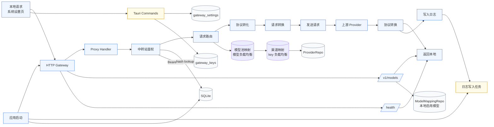

# 网关请求转换路径

## 关键点

- `/v1/models` 读取的是本地启用的模型映射，不是上游目录。
- `/v1/*` 的实际鉴权是 `gateway_keys`，不是 `gateway_settings.auth_token_hash`。
- 请求主链是：本地请求 -> 中转站鉴权 -> 中转站接收 -> 模型池映射（模型负载均衡） -> 渠道映射（key 负载均衡） -> 协议转化 -> 发送请求 -> 获得响应 -> 协议转换 -> 返回本地。
- 请求优先按 body 里的 `model` 走模型映射，失败后再走路由规则兜底。
- 日志是异步写入 SQLite，不阻塞主请求。
