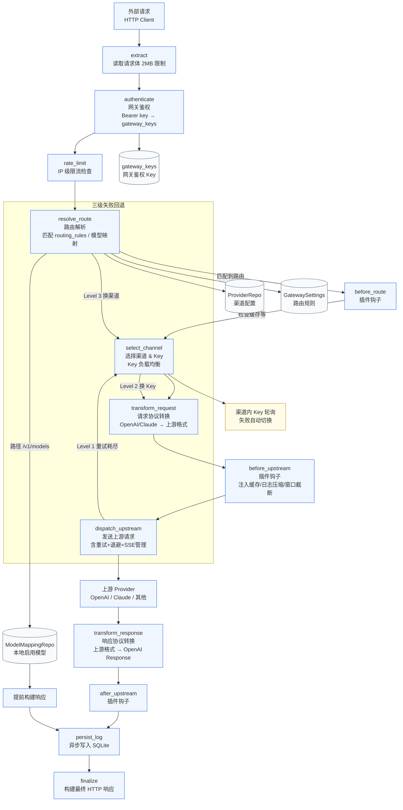

# 网关请求转换路径

## 关键点

- `/v1/models` 读取的是本地启用的模型映射，不是上游目录。
- `/v1/*` 的实际鉴权是 `gateway_keys`，不是 `gateway_settings.auth_token_hash`。
- 请求主链已引入插件钩子系统：
  `extract → authenticate → rate_limit → resolve_route → [before_route] → select_channel → transform_request → [before_upstream] → dispatch_upstream → transform_response → [after_upstream] → persist_log → finalize`。
- 默认开启的 3 个内置原生插件：
  *   **`PromptCachePlugin`**：自动为 Claude 注入 `cache_control` 标记。
  *   **`SlidingWindowPlugin`**：滑动窗口，自动裁剪历史对话。
  *   **`TerminalLogPrunerPlugin`**：控制台/终端大段编译输出日志压缩折叠。
- 路由决策优先级（由高到低）：
  1. **模型映射优先**：先读取请求体 `model` 字段，在 `model_mappings` 表中查找启用映射。命中后按映射配置的负载均衡策略选定 Provider 渠道，支持自动回退。
  2. **路由规则降级**：模型映射未命中时，再按 `RoutingRule` 匹配（Host + Path + Method + ContentType）。
  3. **路径兜底**：路由规则也未命中时，按请求路径自动推断协议，选择任意启用的 Provider。
- 日志是异步写入 SQLite，不阻塞主请求。
- 三级失败回退：单次请求重试 → 换 Key → 换渠道。