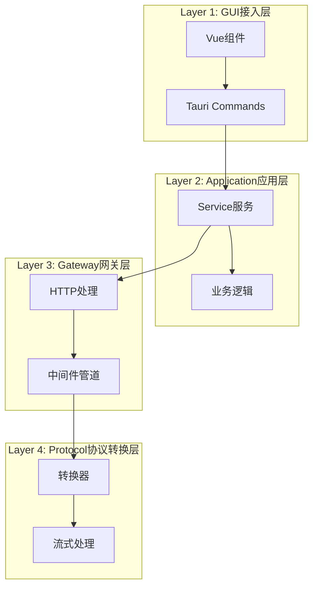
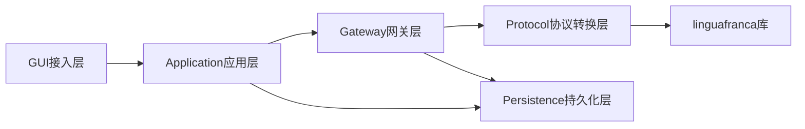
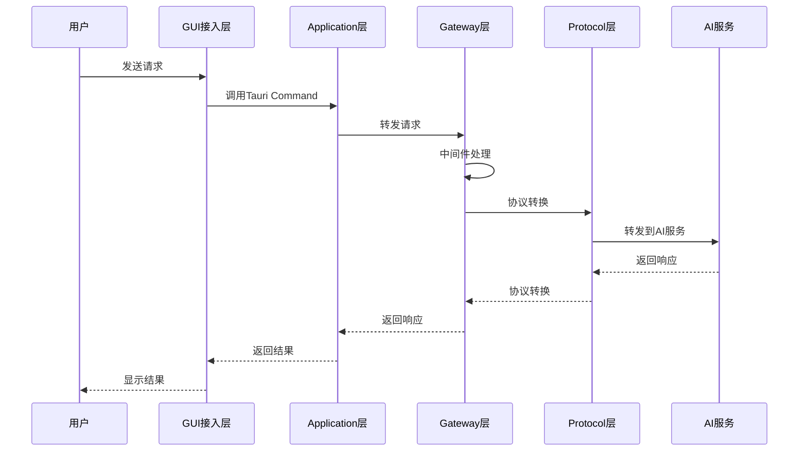
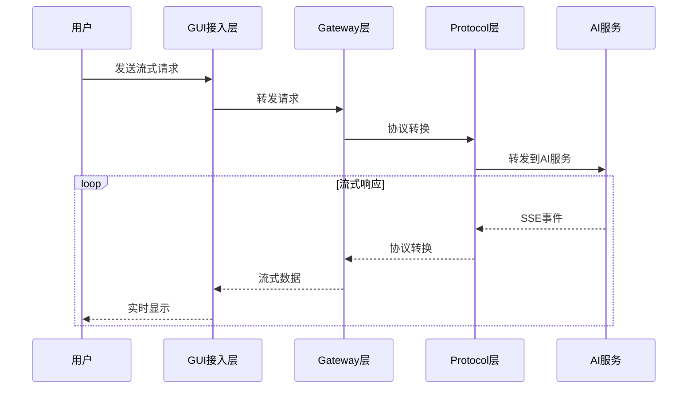
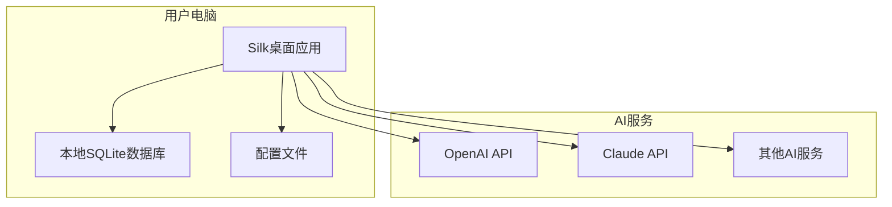
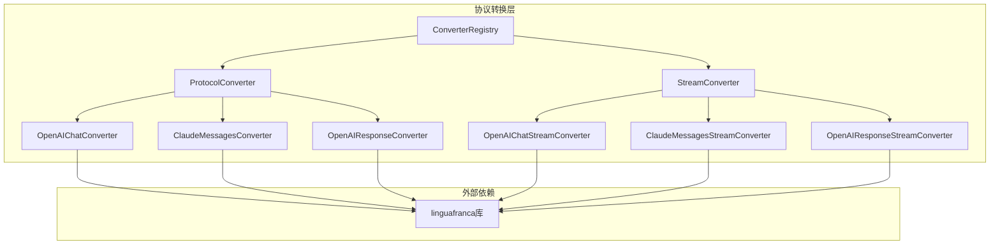

# Phase 3 - 批次1：技术文档编写

## 📋 批次概述

**批次目标**：编写架构设计文档、API文档、开发指南、协议转换层文档

**预计工期**：1周（5个工作日）

**依赖关系**：Phase 1 完成

---

## 🎯 批次目标

1. 编写架构设计文档
2. 编写API文档
3. 编写开发指南
4. 编写协议转换层文档

---

## 📝 任务清单

### 任务1.1：架构设计文档

**文件路径**：`docs/architecture/overview.md`

**任务描述**：
编写系统架构图、分层设计、模块职责文档

**实现步骤**：

1. 创建架构设计文档
```markdown
# Silk 系统架构概述

## 1. 简介

Silk 是一个基于 Tauri 的桌面应用，作为个人AI总机，提供统一的AI服务访问入口。

## 2. 分层架构



### 2.1 Layer 1: GUI接入层

**职责**：
- 用户界面展示
- 用户交互处理
- 状态展示

**边界**：
- 禁止混入HTTP转发、协议转换逻辑
- 仅通过Tauri Commands与Application层交互

**代码位置**：`src/` (Vue组件)

**主要组件**：
- `App.vue` - 应用根组件
- `AppContent.vue` - 主布局组件
- `views/` - 页面组件
- `components/` - 通用组件

### 2.2 Layer 2: Application应用层

**职责**：
- 业务逻辑编排
- 状态管理
- 服务协调

**边界**：
- 不直接处理网络请求
- 通过Gateway层处理HTTP请求

**代码位置**：`src-tauri/src/application/`

**主要服务**：
- `gateway_service.rs` - 网关服务
- `provider_service.rs` - Provider服务
- `log_service.rs` - 日志服务
- `settings_service.rs` - 设置服务

### 2.3 Layer 3: Gateway网关层

**职责**：
- HTTP请求处理
- 中间件管道
- 路由分发

**边界**：
- 不处理协议格式转换细节
- 通过Protocol层进行协议转换

**代码位置**：`src-tauri/src/gateway/`

**主要组件**：
- `pipeline.rs` - 请求处理管道
- `middleware/` - 中间件模块
- `context.rs` - 请求上下文

### 2.4 Layer 4: Protocol协议转换层

**职责**：
- 无状态协议转换
- 流式字节流处理
- 支持多种AI协议

**边界**：
- 仅处理字节流，不承担网络通信
- 完全无状态设计

**代码位置**：`src-tauri/src/protocol/`

**主要组件**：
- `converter.rs` - 协议转换抽象层
- `converters/` - 协议转换器实现
- `stream/` - 流式转换器

## 3. 模块依赖关系



## 4. 数据流

### 4.1 请求处理流程



### 4.2 流式响应流程



## 5. 技术栈

### 5.1 前端
- **框架**：Vue 3 + TypeScript
- **UI库**：Naive UI
- **状态管理**：Pinia
- **路由**：Vue Router
- **构建工具**：Vite

### 5.2 后端
- **框架**：Tauri + Rust
- **HTTP服务器**：Axum
- **数据库**：SQLite
- **异步运行时**：Tokio

### 5.3 协议转换
- **库**：linguafranca
- **支持协议**：
  - OpenAI Chat Completions
  - Claude Messages
  - OpenAI Responses

## 6. 部署架构



## 7. 安全考虑

### 7.1 API密钥安全
- API密钥加密存储在本地
- 不上传到任何服务器
- 仅在本地使用

### 7.2 网络安全
- 默认仅监听本地地址（127.0.0.1）
- 可选开启远程访问
- 支持HTTPS（可选）

### 7.3 数据安全
- 所有数据存储在本地
- 不收集用户数据
- 支持数据备份和恢复

## 8. 扩展性

### 8.1 协议扩展
- 支持添加新的AI协议
- 通过实现ProtocolConverter接口
- 插件化设计

### 8.2 功能扩展
- 支持添加新的中间件
- 支持自定义路由规则
- 支持插件系统
```

**验收标准**：
- [ ] 架构图清晰准确
- [ ] 分层设计说明完整
- [ ] 模块职责明确
- [ ] 数据流说明清晰

---

### 任务1.2：API文档

**文件路径**：`docs/api/README.md`

**任务描述**：
编写Tauri Commands API、Gateway API、Protocol API文档

**实现步骤**：

1. 创建API文档
```markdown
# Silk API 文档

## 1. Tauri Commands API

Tauri Commands 是前端与后端通信的接口。

### 1.1 Gateway 控制

#### `gateway_status`
获取网关状态。

**参数**：无

**返回值**：
```typescript
interface GatewayStatusResponse {
  running: boolean;
  address: string;
  settings: GatewaySettingsInfo;
}
```

**示例**：
```typescript
const status = await invoke('gateway_status');
console.log(status.running); // true/false
console.log(status.address); // "127.0.0.1:1877"
```

#### `gateway_start`
启动网关。

**参数**：无

**返回值**：
```typescript
interface GatewayStartResponse {
  success: boolean;
  address: string;
}
```

**示例**：
```typescript
const result = await invoke('gateway_start');
if (result.success) {
  console.log('网关已启动', result.address);
}
```

#### `gateway_stop`
停止网关。

**参数**：无

**返回值**：
```typescript
interface GatewayStopResponse {
  success: boolean;
  message: string;
}
```

#### `gateway_restart`
重启网关。

**参数**：无

**返回值**：同 `gateway_start`

### 1.2 Provider 管理

#### `list_providers`
获取所有Provider列表。

**参数**：无

**返回值**：
```typescript
interface Provider {
  id: string;
  name: string;
  protocols: string[];
  models: string[];
  api_base_url: string;
  status: string;
  // ... 其他字段
}
```

#### `create_provider`
创建新的Provider。

**参数**：
```typescript
interface CreateProviderRequest {
  name: string;
  protocols: string[];
  models: string[];
  api_base_url: string;
  api_key: string;
  // ... 其他字段
}
```

**返回值**：`Provider`

#### `update_provider`
更新Provider。

**参数**：
```typescript
interface UpdateProviderRequest {
  id: string;
  name?: string;
  protocols?: string[];
  models?: string[];
  api_base_url?: string;
  api_key?: string;
  // ... 其他字段
}
```

**返回值**：`Provider`

#### `delete_provider`
删除Provider。

**参数**：
```typescript
interface DeleteProviderRequest {
  id: string;
}
```

**返回值**：`void`

### 1.3 日志管理

#### `list_logs`
获取请求日志列表。

**参数**：
```typescript
interface ListLogsRequest {
  limit?: number;
  offset?: number;
  provider_id?: string;
  status_code?: number;
  start_time?: string;
  end_time?: string;
}
```

**返回值**：
```typescript
interface RequestLog {
  request_id: string;
  provider_name: string;
  model_name: string;
  status_code: number;
  total_duration_ms: number;
  tokens_input: number;
  tokens_output: number;
  created_at: string;
  // ... 其他字段
}
```

### 1.4 设置管理

#### `get_gateway_settings`
获取网关设置。

**参数**：无

**返回值**：
```typescript
interface GatewaySettings {
  bind_host: string;
  bind_port: number;
  allow_remote: boolean;
  auto_start_gateway: boolean;
  launch_at_startup: boolean;
  close_to_tray: boolean;
  // ... 其他字段
}
```

#### `update_gateway_settings`
更新网关设置。

**参数**：
```typescript
interface UpdateGatewaySettingsRequest {
  bind_host?: string;
  bind_port?: number;
  allow_remote?: boolean;
  auto_start_gateway?: boolean;
  launch_at_startup?: boolean;
  close_to_tray?: boolean;
  // ... 其他字段
}
```

**返回值**：`GatewaySettings`

## 2. Gateway API

Gateway API 是Silk对外提供的HTTP API。

### 2.1 健康检查

#### `GET /health`
检查网关是否正常运行。

**响应**：
```json
{
  "status": "ok",
  "service": "silk-gateway"
}
```

### 2.2 Chat Completions

#### `POST /v1/chat/completions`
OpenAI Chat Completions 兼容接口。

**请求体**：
```json
{
  "model": "gpt-4",
  "messages": [
    {"role": "user", "content": "Hello"}
  ],
  "temperature": 0.7,
  "stream": false
}
```

**响应体**：
```json
{
  "id": "chatcmpl-123",
  "object": "chat.completion",
  "created": 1234567890,
  "model": "gpt-4",
  "choices": [
    {
      "index": 0,
      "message": {
        "role": "assistant",
        "content": "Hello! How can I help you?"
      },
      "finish_reason": "stop"
    }
  ],
  "usage": {
    "prompt_tokens": 10,
    "completion_tokens": 15,
    "total_tokens": 25
  }
}
```

### 2.3 Claude Messages

#### `POST /v1/messages`
Claude Messages 兼容接口。

**请求体**：
```json
{
  "model": "claude-3-opus-20240229",
  "max_tokens": 1024,
  "messages": [
    {"role": "user", "content": "Hello"}
  ]
}
```

**响应体**：
```json
{
  "id": "msg_123",
  "type": "message",
  "role": "assistant",
  "content": [
    {
      "type": "text",
      "text": "Hello! How can I help you?"
    }
  ],
  "model": "claude-3-opus-20240229",
  "stop_reason": "end_turn",
  "usage": {
    "input_tokens": 10,
    "output_tokens": 15
  }
}
```

## 3. Protocol API

Protocol API 是协议转换层的内部API。

### 3.1 ProtocolConverter

协议转换器接口。

```rust
#[async_trait]
pub trait ProtocolConverter: Send + Sync {
    fn name(&self) -> &str;
    fn source_protocols(&self) -> Vec<&str>;
    fn target_protocols(&self) -> Vec<&str>;
    fn supports(&self, from: &str, to: &str) -> bool;
    
    async fn convert_request(
        &self,
        body: &[u8],
        from_protocol: &str,
        to_protocol: &str,
    ) -> Result<Bytes, ConversionError>;
    
    async fn convert_response(
        &self,
        body: &[u8],
        from_protocol: &str,
        to_protocol: &str,
    ) -> Result<Bytes, ConversionError>;
}
```

### 3.2 StreamConverter

流式协议转换器接口。

```rust
#[async_trait]
pub trait StreamConverter: Send + Sync {
    fn name(&self) -> &str;
    fn source_protocols(&self) -> Vec<&str>;
    fn target_protocols(&self) -> Vec<&str>;
    fn supports(&self, from: &str, to: &str) -> bool;
    
    async fn convert_event(
        &self,
        event: &SseEvent,
        from_protocol: &str,
        to_protocol: &str,
    ) -> Result<Vec<SseEvent>, StreamConversionError>;
}
```

## 4. 错误码

### 4.1 Tauri Commands 错误码

| 错误码 | 描述 | 解决方案 |
|--------|------|----------|
| `DB_NOT_INITIALIZED` | 数据库未初始化 | 重启应用 |
| `PROVIDER_NOT_FOUND` | Provider不存在 | 检查Provider ID |
| `INVALID_API_KEY` | API密钥无效 | 更新API密钥 |
| `GATEWAY_ALREADY_RUNNING` | 网关已在运行 | 先停止网关 |
| `GATEWAY_NOT_RUNNING` | 网关未运行 | 先启动网关 |

### 4.2 Gateway API 错误码

| HTTP状态码 | 描述 | 解决方案 |
|------------|------|----------|
| 400 | 请求格式错误 | 检查请求体格式 |
| 401 | 认证失败 | 检查API密钥 |
| 429 | 请求过于频繁 | 降低请求频率 |
| 500 | 服务器内部错误 | 稍后重试 |
| 502 | 上游服务不可用 | 检查AI服务状态 |
| 503 | 网关未运行 | 启动网关 |
```

**验收标准**：
- [ ] API文档完整
- [ ] 参数说明清晰
- [ ] 示例代码正确
- [ ] 错误码说明完整

---

### 任务1.3：开发指南

**文件路径**：`docs/development/README.md`

**任务描述**：
编写开发环境搭建、代码规范、贡献指南

**实现步骤**：

1. 创建开发指南
```markdown
# Silk 开发指南

## 1. 开发环境搭建

### 1.1 系统要求

- **操作系统**：Windows 10+, macOS 10.15+, Ubuntu 18.04+
- **Node.js**：16.0+
- **Rust**：1.70+
- **pnpm**：8.0+

### 1.2 安装依赖

```bash
# 克隆仓库
git clone https://github.com/silk/silk.git
cd silk

# 安装前端依赖
pnpm install

# 安装 Rust 依赖
cd src-tauri
cargo build
```

### 1.3 开发模式

```bash
# 启动开发服务器
pnpm tauri dev
```

### 1.4 构建生产版本

```bash
# 构建生产版本
pnpm tauri build
```

## 2. 项目结构

```
silk/
├── src/                    # 前端源码
│   ├── components/         # Vue组件
│   ├── views/              # 页面组件
│   ├── stores/             # Pinia状态管理
│   ├── api/                # API调用
│   ├── utils/              # 工具函数
│   └── assets/             # 静态资源
├── src-tauri/              # 后端源码
│   ├── src/                # Rust源码
│   │   ├── application/    # 应用层
│   │   ├── commands/       # Tauri命令
│   │   ├── gateway/        # 网关层
│   │   ├── protocol/       # 协议转换层
│   │   ├── persistence/    # 持久化层
│   │   └── models/         # 数据模型
│   └── Cargo.toml          # Rust依赖配置
├── docs/                   # 文档
└── package.json            # 前端依赖配置
```

## 3. 代码规范

### 3.1 Rust 代码规范

- 使用 `rustfmt` 格式化代码
- 使用 `clippy` 进行代码检查
- 遵循 Rust 官方风格指南

```bash
# 格式化代码
cargo fmt

# 代码检查
cargo clippy
```

### 3.2 TypeScript 代码规范

- 使用 ESLint 进行代码检查
- 使用 Prettier 格式化代码
- 遵循 Vue 3 风格指南

```bash
# 代码检查
pnpm lint

# 格式化代码
pnpm format
```

### 3.3 命名规范

- **Rust**：
  - 模块名：snake_case
  - 结构体名：PascalCase
  - 函数名：snake_case
  - 常量名：SCREAMING_SNAKE_CASE

- **TypeScript**：
  - 组件名：PascalCase
  - 变量名：camelCase
  - 常量名：SCREAMING_SNAKE_CASE
  - 文件名：kebab-case

## 4. 提交规范

### 4.1 Commit Message 格式

```
<type>(<scope>): <subject>

<body>

<footer>
```

**Type 类型**：
- `feat`：新功能
- `fix`：修复bug
- `docs`：文档更新
- `style`：代码格式调整
- `refactor`：重构
- `test`：测试相关
- `chore`：构建/工具相关

**示例**：
```
feat(protocol): 添加Claude协议转换器

- 实现Claude Messages协议转换
- 添加单元测试
- 更新文档

Closes #123
```

### 4.2 分支规范

- `main`：主分支，保持稳定
- `develop`：开发分支
- `feature/*`：功能分支
- `fix/*`：修复分支
- `release/*`：发布分支

## 5. 测试指南

### 5.1 运行测试

```bash
# 运行所有测试
cargo test

# 运行特定测试
cargo test test_name

# 运行前端测试
pnpm test
```

### 5.2 编写测试

#### Rust 单元测试

```rust
#[cfg(test)]
mod tests {
    use super::*;
    
    #[test]
    fn test_function_name() {
        // 测试逻辑
        assert_eq!(result, expected);
    }
    
    #[tokio::test]
    async fn test_async_function() {
        // 异步测试逻辑
        let result = async_function().await;
        assert!(result.is_ok());
    }
}
```

#### TypeScript 单元测试

```typescript
import { describe, it, expect } from 'vitest';

describe('Component', () => {
  it('should render correctly', () => {
    // 测试逻辑
    expect(result).toBe(expected);
  });
});
```

## 6. 调试指南

### 6.1 Rust 调试

```bash
# 启用调试日志
RUST_LOG=debug cargo tauri dev

# 使用dbg!宏
dbg!(&variable);
```

### 6.2 前端调试

- 使用浏览器开发者工具
- 使用 Vue Devtools
- 使用 console.log

## 7. 发布流程

### 7.1 版本号规范

遵循 [Semantic Versioning](https://semver.org/)：
- MAJOR.MINOR.PATCH
- 例如：1.0.0

### 7.2 发布步骤

1. 更新版本号
2. 更新 CHANGELOG.md
3. 创建发布分支
4. 运行测试
5. 构建生产版本
6. 创建 GitHub Release
7. 合并到 main 分支

## 8. 常见问题

### 8.1 编译错误

**问题**：Rust 编译错误

**解决**：
```bash
# 清理构建缓存
cargo clean

# 重新构建
cargo build
```

### 8.2 依赖问题

**问题**：npm 依赖冲突

**解决**：
```bash
# 清理 node_modules
rm -rf node_modules

# 重新安装依赖
pnpm install
```

### 8.3 运行时错误

**问题**：应用启动失败

**解决**：
1. 检查日志输出
2. 确认依赖已安装
3. 确认端口未被占用
```

**验收标准**：
- [ ] 开发环境搭建说明完整
- [ ] 代码规范清晰
- [ ] 提交规范明确
- [ ] 测试指南实用

---

### 任务1.4：协议转换层文档

**文件路径**：`docs/architecture/protocol-conversion.md`

**任务描述**：
编写协议转换设计、转换器接口、使用示例

**实现步骤**：

1. 创建协议转换层文档
```markdown
# 协议转换层设计

## 1. 概述

协议转换层是Silk的核心组件，负责在不同的AI协议之间进行转换。

## 2. 设计原则

### 2.1 无状态设计
- 转换器不保存任何状态
- 每次转换都是独立的
- 便于测试和扩展

### 2.2 流式处理
- 支持SSE流式响应
- 实时转换，低延迟
- 内存效率高

### 2.3 可插拔架构
- 通过接口定义转换器
- 支持动态注册
- 便于扩展新协议

## 3. 架构设计



## 4. 核心接口

### 4.1 ProtocolConverter

协议转换器接口，用于非流式请求/响应转换。

```rust
#[async_trait]
pub trait ProtocolConverter: Send + Sync {
    /// 转换器名称
    fn name(&self) -> &str;
    
    /// 支持的源协议
    fn source_protocols(&self) -> Vec<&str>;
    
    /// 支持的目标协议
    fn target_protocols(&self) -> Vec<&str>;
    
    /// 检查是否支持指定的协议转换
    fn supports(&self, from: &str, to: &str) -> bool;
    
    /// 转换请求体
    async fn convert_request(
        &self,
        body: &[u8],
        from_protocol: &str,
        to_protocol: &str,
    ) -> Result<Bytes, ConversionError>;
    
    /// 转换响应体
    async fn convert_response(
        &self,
        body: &[u8],
        from_protocol: &str,
        to_protocol: &str,
    ) -> Result<Bytes, ConversionError>;
}
```

### 4.2 StreamConverter

流式协议转换器接口，用于SSE流式响应转换。

```rust
#[async_trait]
pub trait StreamConverter: Send + Sync {
    /// 转换器名称
    fn name(&self) -> &str;
    
    /// 支持的源协议
    fn source_protocols(&self) -> Vec<&str>;
    
    /// 支持的目标协议
    fn target_protocols(&self) -> Vec<&str>;
    
    /// 检查是否支持指定的协议转换
    fn supports(&self, from: &str, to: &str) -> bool;
    
    /// 转换SSE事件
    async fn convert_event(
        &self,
        event: &SseEvent,
        from_protocol: &str,
        to_protocol: &str,
    ) -> Result<Vec<SseEvent>, StreamConversionError>;
}
```

### 4.3 ConverterRegistry

转换器注册表，管理所有转换器。

```rust
pub struct ConverterRegistry {
    converters: HashMap<String, Arc<dyn ProtocolConverter>>,
}

impl ConverterRegistry {
    pub fn new() -> Self;
    pub fn register(&mut self, converter: Arc<dyn ProtocolConverter>);
    pub fn get(&self, name: &str) -> Option<&Arc<dyn ProtocolConverter>>;
    pub fn find_converter(&self, from: &str, to: &str) -> Option<&Arc<dyn ProtocolConverter>>;
    pub fn list_converters(&self) -> Vec<&str>;
}
```

## 5. 支持的协议

### 5.1 OpenAI Chat Completions

**协议标识**：`openai_chat`

**请求格式**：
```json
{
  "model": "gpt-4",
  "messages": [
    {"role": "user", "content": "Hello"}
  ],
  "temperature": 0.7,
  "stream": false
}
```

**响应格式**：
```json
{
  "id": "chatcmpl-123",
  "object": "chat.completion",
  "choices": [
    {
      "message": {
        "role": "assistant",
        "content": "Hello!"
      }
    }
  ]
}
```

### 5.2 Claude Messages

**协议标识**：`claude_messages`

**请求格式**：
```json
{
  "model": "claude-3-opus-20240229",
  "max_tokens": 1024,
  "messages": [
    {"role": "user", "content": "Hello"}
  ]
}
```

**响应格式**：
```json
{
  "id": "msg_123",
  "type": "message",
  "content": [
    {"type": "text", "text": "Hello!"}
  ]
}
```

### 5.3 OpenAI Responses

**协议标识**：`openai_response`

**请求格式**：
```json
{
  "model": "gpt-4",
  "input": "Hello"
}
```

**响应格式**：
```json
{
  "id": "resp_123",
  "object": "response",
  "output": [
    {"type": "message", "content": "Hello!"}
  ]
}
```

## 6. 使用示例

### 6.1 非流式转换

```rust
use crate::protocol::converter::{ConverterRegistry, ProtocolConverter};
use crate::protocol::converters::*;

// 创建注册表
let mut registry = ConverterRegistry::new();
registry.register(Arc::new(OpenAIChatConverter::new()));
registry.register(Arc::new(ClaudeMessagesConverter::new()));

// 查找转换器
let converter = registry.find_converter("openai_chat", "claude_messages").unwrap();

// 转换请求
let request_body = serde_json::json!({
    "model": "gpt-4",
    "messages": [{"role": "user", "content": "Hello"}]
});

let converted = converter.convert_request(
    &serde_json::to_vec(&request_body).unwrap(),
    "openai_chat",
    "claude_messages",
).await?;
```

### 6.2 流式转换

```rust
use crate::protocol::stream::{
    SseEvent, StreamConverterRegistry, StreamConverter,
};
use crate::protocol::stream::converters::*;

// 创建注册表
let mut registry = StreamConverterRegistry::new();
registry.register(Arc::new(OpenAIChatStreamConverter::new()));
registry.register(Arc::new(ClaudeMessagesStreamConverter::new()));

// 查找转换器
let converter = registry.find_converter("openai_chat", "claude_messages").unwrap();

// 转换SSE事件
let event = SseEvent {
    event: None,
    data: Some(r#"{"id":"chatcmpl-123","choices":[{"delta":{"content":"Hello"}}]}"#.to_string()),
    id: None,
    retry: None,
    comment: None,
};

let converted_events = converter.convert_event(
    &event,
    "openai_chat",
    "claude_messages",
).await?;
```

## 7. 扩展新协议

### 7.1 实现ProtocolConverter

```rust
use async_trait::async_trait;
use bytes::Bytes;
use crate::protocol::converter::{ConversionError, ProtocolConverter};

pub struct MyProtocolConverter;

#[async_trait]
impl ProtocolConverter for MyProtocolConverter {
    fn name(&self) -> &str {
        "my_protocol"
    }
    
    fn source_protocols(&self) -> Vec<&str> {
        vec!["my_protocol", "openai_chat"]
    }
    
    fn target_protocols(&self) -> Vec<&str> {
        vec!["my_protocol", "openai_chat"]
    }
    
    async fn convert_request(
        &self,
        body: &[u8],
        from_protocol: &str,
        to_protocol: &str,
    ) -> Result<Bytes, ConversionError> {
        // 实现转换逻辑
        todo!()
    }
    
    async fn convert_response(
        &self,
        body: &[u8],
        from_protocol: &str,
        to_protocol: &str,
    ) -> Result<Bytes, ConversionError> {
        // 实现转换逻辑
        todo!()
    }
}
```

### 7.2 注册转换器

```rust
// 在 application/gateway_service.rs 中
let mut registry = ConverterRegistry::new();
registry.register(Arc::new(MyProtocolConverter::new()));
// ... 注册其他转换器
```

## 8. 错误处理

### 8.1 ConversionError

```rust
#[derive(Error, Debug)]
pub enum ConversionError {
    #[error("解析失败: {0}")]
    ParseError(String),
    
    #[error("转换失败: {0}")]
    TransformError(String),
    
    #[error("序列化失败: {0}")]
    SerializationError(String),
    
    #[error("不支持的协议: {0}")]
    UnsupportedProtocol(String),
    
    #[error("内部错误: {0}")]
    InternalError(String),
}
```

### 8.2 StreamConversionError

```rust
#[derive(Error, Debug)]
pub enum StreamConversionError {
    #[error("解析失败: {0}")]
    ParseError(String),
    
    #[error("转换失败: {0}")]
    TransformError(String),
    
    #[error("序列化失败: {0}")]
    SerializationError(String),
    
    #[error("不支持的协议: {0}")]
    UnsupportedProtocol(String),
    
    #[error("流超时")]
    Timeout,
    
    #[error("内部错误: {0}")]
    InternalError(String),
}
```

## 9. 性能考虑

### 9.1 内存优化
- 使用零拷贝技术
- 避免不必要的内存分配
- 及时释放资源

### 9.2 并发处理
- 支持异步处理
- 使用Tokio运行时
- 避免阻塞操作

### 9.3 缓存策略
- 缓存常用转换结果
- 使用LRU缓存
- 定期清理过期缓存

## 10. 测试策略

### 10.1 单元测试
- 测试每个转换器
- 测试边界条件
- 测试错误处理

### 10.2 集成测试
- 测试端到端流程
- 测试协议兼容性
- 测试性能指标

### 10.3 性能测试
- 测试转换延迟
- 测试内存占用
- 测试并发性能
```

**验收标准**：
- [ ] 协议转换设计清晰
- [ ] 接口说明完整
- [ ] 使用示例实用
- [ ] 扩展指南清晰

---

## 📦 批次交付物

1. `docs/architecture/overview.md` - 架构设计文档
2. `docs/api/README.md` - API文档
3. `docs/development/README.md` - 开发指南
4. `docs/architecture/protocol-conversion.md` - 协议转换层文档

---

## ✅ 批次验收标准

- [ ] 所有文档编写完成
- [ ] 文档内容准确
- [ ] 示例代码可运行
- [ ] 文档格式规范

---

## 📅 时间安排

| 任务 | 预计时间 | 开始时间 | 结束时间 |
|------|----------|----------|----------|
| 任务1.1 | 1天 | 第1天 | 第1天 |
| 任务1.2 | 1.5天 | 第2天 | 第3天上午 |
| 任务1.3 | 1天 | 第3天下午 | 第4天 |
| 任务1.4 | 1天 | 第5天 | 第5天 |
